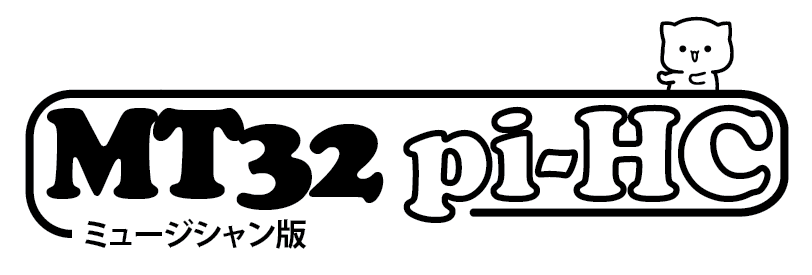
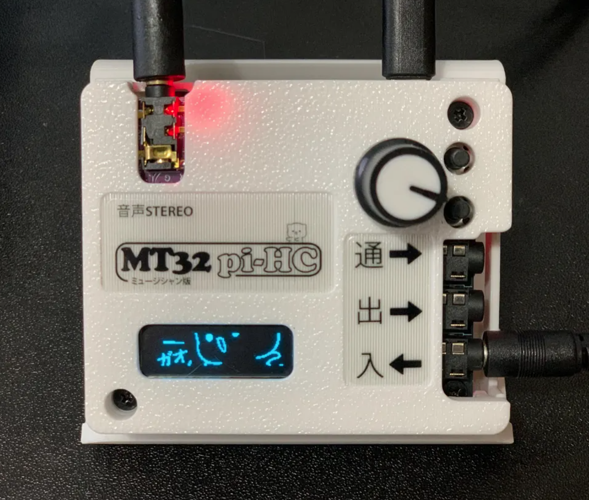

<h1 align="center">
    
</h1>

- A work-in-progress baremetal MIDI synthesizer for the Raspberry Pi 3 or above, based on [Munt], [FluidSynth] and [Circle].

- Turn your Raspberry Pi into a dedicated emulation of the [famous multi-timbre sound module][Roland MT-32] used by countless classic MS-DOS, PC-98 and Sharp X68000 games!

- Add your favorite [SoundFonts][SoundFont] to expand your synthesizer with [General MIDI], [Roland GS], or even [Yamaha XG] support for endless MIDI possibilities.

- Includes General MIDI and Roland GS support out of the box thanks to [GeneralUser GS] by S. Christian Collins.

- No operating system, no complex Linux audio configuration; just super-low latency audio.

- Easy to configure and ready to play from cold-boot in a matter of seconds.

---

## New features 0.25.0

### MIDI Channel Settings Menu
Press the encoder knob to access the MIDI channel settings menu where you can:
- **Channel**: Select MIDI channel (1-16)
- **Mute**: Toggle channel mute on/off
- **Volume**: Adjust channel volume (0-127)
- **Program**: Change program/patch number (0-127)
- **Route**: Route channel to different output channel
- **Next**: Navigate to Animation Settings menu
- **Exit**: Return to normal display

### Animation Settings Menu
From the MIDI Channel Settings menu, select "Next" to access animation settings:
- **Mode**: Choose visualization mode:
  - **BarGraph**: Classic MIDI activity bar graph (default)
  - **Animation**: Cute face animations that react to MIDI
  - **Asteroids**: MIDI-reactive asteroids game with AI ship - notes spawn asteroids
  - **MatrixRain**: Matrix-style falling characters that react to note velocity
  - **Oscilloscope**: Real-time waveform display with MIDI-triggered waves
- **Next**: Navigate to Preset Menu (save/load MIDI channel configurations)
- **Back**: Return to MIDI Channel Settings menu
- **Exit**: Return to normal display

All three new visualization modes (Asteroids, MatrixRain, Oscilloscope) are fully MIDI-reactive and respond dynamically to incoming MIDI notes.

### Persistent Settings
The device now remembers your preferences across reboots:
- **Last selected visualization mode** - Your chosen animation mode is saved automatically and restored on boot
- **Last used SoundFont** - The device remembers which SoundFont you were using and loads it automatically on next boot

These settings are stored in separate state files on the SD card and persist through power loss.

## Project status

This repository is a clone of the original where I will be making my own changes and is not affiliated with the original project. This repository is for a specific hardware build of the device by HobbyChop and therefore this readme file will be stripped down to include only what is related to that specific device. 

The goal of this development is focused on features for musicians, and the focus will not be on mister integration.

- [I²S Hi-Fi DAC support][I²S Hi-Fi DACs].
  * This is the recommended audio output method for the best quality audio.

- MIDI input, output and thru via TRS A MIDI interfaces, or Serial.

- [Configuration file] for selecting hardware options and fine tuning.

- [LCD status screen support][LCD and OLED displays] (for MT-32 SysEx messages and status information).

- Simple [physical control surface][control surface] using buttons and rotary encoder.

- Network MIDI support via [RTP-MIDI] and [raw UDP socket].

- [Embedded FTP server][FTP server] for remote access to files.

## Installation

1. Download the latest release from the [Releases] section.

2. Extract contents to a blank [FAT32-formatted SD card][SD card preparation].

3. For MT-32 support, add your MT-32 or CM-32L ROM images to the `roms` directory - you have to provide these for copyright reasons.

4. Add your favorite SoundFonts to the `soundfonts` directory.

5. The `mt32-pi.cfg` file has already been configured for the hardware and the MIDI hat, but feel free to look through the options and make any tweaks.

6. Connect a [USB MIDI interface][USB MIDI interfaces] or [GPIO MIDI circuit][GPIO MIDI interface] to the Pi, and connect some speakers to the headphone jack.

7. Connect your vintage PC's MIDI OUT to the Pi's MIDI IN and (optionally) vice versa.

Device available here: https://hobbychop.com
